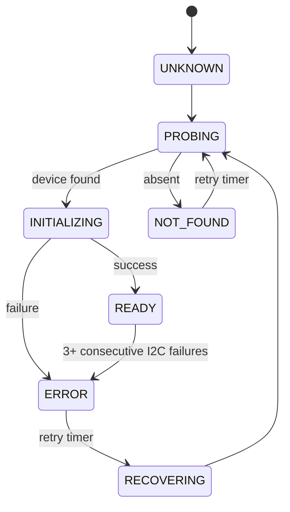

# Room Sensor

Firmware for NUCLEO-G474RE with VEML7700 ambient light sensor and SH1106/SSD1306 OLED display.

## Hardware

| Component | Connection |
|-----------|-----------|
| MCU       | STM32G474RET6 (NUCLEO-G474RE) |
| I2C1 SCL  | PB8 (Arduino D15) |
| I2C1 SDA  | PB9 (Arduino D14) |
| Light     | VEML7700 (0x10) |
| Display   | SH1106 / SSD1306 (0x3C) |

## Software Versions

- STM32CubeMX 6.18.1 (FW_G4 1.6.3)
- ARM GCC 14.3.rel1 (GNU Tools for STM32)
- CMake 4.3.1 + Ninja 1.13.2

## Build & Flash

```bash
cmake -B build/Debug -G Ninja -DCMAKE_BUILD_TYPE=Debug
cmake --build build/Debug --target room_sensor
STM32_Programmer_CLI -c port=SWD mode=UR -w build/Debug/room_sensor.elf -rst
```

## Architecture

```
Application/User/
├── App/              # Application logic, scheduler, device lifecycle
├── Drivers/
│   ├── display/      # OLED driver (SH1106 + SSD1306)
│   └── veml7700/     # Ambient light sensor driver with autoranging
├── Platform/         # I2C bus + time abstraction (portable)
└── Common/           # Shared types, DeviceState, DeviceRuntime
```

## Device State Machine



## Cooperative Scheduler

| Period | Task |
|--------|------|
| 500 ms | VEML7700 light measurement |
| 500 ms | OLED display update |
| 5000 ms | Device retry (probe/reinit) |
| 10000 ms | UART diagnostic log |

## Error & Recovery

- Consecutive-error threshold: 3
- Recovery interval: 5 seconds
- Recovery increments `recovery_count` in `DeviceRuntime`
- One device failure does not affect the other (degraded mode)
- OLED shows `Light: N/A` when VEML is unavailable
- OLED shows `Light: ---` during recovery

## UART Diagnostics

Every 10 seconds via VCP (115200 baud):

```
APP uptime=10000
LIGHT state=4 lux=32 ops=20 err=0 consec=0 rec=0
DISPLAY state=4 ops=21 err=0 consec=0 rec=0
```

## Pin Configuration (room_sensor.ioc)

| Signal | Pin  | Function |
|--------|------|----------|
| I2C1_SCL | PB8 | AF4 |
| I2C1_SDA | PB9 | AF4 |

## Features

- I2C bus abstraction (portable between G4/H7)
- Platform time abstraction (portable)
- Device state machine with degraded mode and auto-recovery
- VEML7700 autoranging (gain + integration time)
- Cooperative scheduler (no blocking HAL_Delay in main loop)
- No exported globals — App_GetStatus() provides runtime status
- 0 errors, 0 warnings build