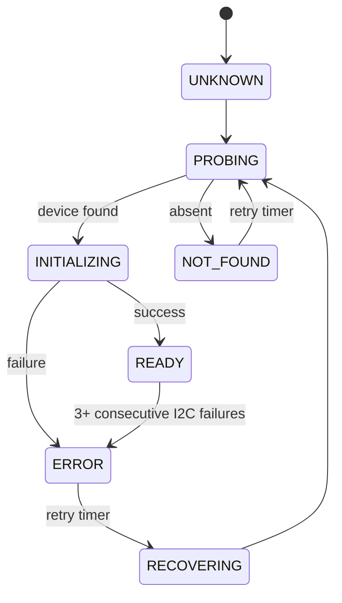

# Room Sensor

Firmware for NUCLEO-G474RE with VEML7700 ambient light sensor and SH1106/SSD1306 OLED display.

## Hardware

| Component | Connection |
|-----------|-----------|
| MCU       | STM32G474RET6 (NUCLEO-G474RE) |
| I2C1 SCL  | PB8 (Arduino D15) |
| I2C1 SDA  | PB9 (Arduino D14) |
| Light     | VEML7700 (0x10) |
| Display   | SH1106 / SSD1306 (0x3C) |

## Software Versions

- STM32CubeMX 6.18.1 (FW_G4 1.6.3)
- ARM GCC 14.3.rel1 (GNU Tools for STM32)
- CMake 4.3.1 + Ninja 1.13.2

## Build & Flash

```bash
cmake -B build/Debug -G Ninja -DCMAKE_BUILD_TYPE=Debug
cmake --build build/Debug --target room_sensor
STM32_Programmer_CLI -c port=SWD mode=UR -w build/Debug/room_sensor.elf -rst
```

## Architecture

```
Application/User/
├── App/            # Application logic, scheduler, device lifecycle
│   ├── app.c/h         — main loop, scheduling, runtime
│   ├── room_state.c/h  — measured room environment (illuminance, temp, etc.)
│   └── config.c/h      — compile-time defaults, scheduler periods
├── Drivers/
│   ├── display/         — OLED driver (SH1106 + SSD1306)
│   └── veml7700/        — Ambient light sensor driver with autoranging
├── Platform/           — I2C bus + time abstraction (portable G4 ↔ H7)
└── Common/             — Shared types, DeviceState, DeviceRuntime
```

### Data flow

```
Driver → DeviceRuntime → RoomState → Display / UART
         (state machine)  (physical    (output)
                          environment)
```

- **Driver** handles I2C communication and autoranging
- **DeviceRuntime** tracks state machine, errors, recovery
- **RoomState** holds measured physical values (illuminance, future: temp, humidity, etc.)
- **Config** holds all scheduler periods and tunable constants in one place
- **App** reads RoomState for display and diagnostics

### AppStatus vs RoomState

- `AppStatus` — firmware runtime: device states, counters, uptime
- `RoomState` — physical environment: illuminance, temperature, humidity (future)

## Device State Machine



## Cooperative Scheduler

| Period | Task | Source |
|--------|------|--------|
| 500 ms | VEML7700 light measurement | `Config_Get().light_period_ms` |
| 500 ms | OLED display update | `Config_Get().display_period_ms` |
| 5000 ms | Device retry (probe/reinit) | `Config_Get().retry_period_ms` |
| 10000 ms | UART diagnostic log | `Config_Get().diag_period_ms` |

## Error & Recovery

- Consecutive-error threshold: 3
- Recovery interval: 5 seconds
- Recovery increments `recovery_count` in `DeviceRuntime`
- One device failure does not affect the other (degraded mode)
- OLED shows `Light: N/A` when VEML is unavailable
- OLED shows `Light: ---` during recovery/settling

## UART Diagnostics

Every 10 seconds via VCP (115200 baud):

```
APP uptime=10000
LIGHT state=4 room_lux=30 ops=20 err=0 consec=0 rec=0
DISPLAY state=4 ops=21 err=0 consec=0 rec=0
```

## Adding a New Sensor

1. Add driver to `Drivers/`
2. Add field(s) to `RoomState` in `room_state.h`
3. Add `RoomState_Update*()` in `room_state.c`
4. Add `App_DoProbe*`, `App_DoInit*`, `App_DoRead*` in `app.c`
5. Add scheduler task in `App_Run()`
6. Display or log from `RoomState_Get()`

The architecture does not change for additional sensors.

## Pin Configuration (room_sensor.ioc)

| Signal | Pin  | Function |
|--------|------|----------|
| I2C1_SCL | PB8 | AF4 |
| I2C1_SDA | PB9 | AF4 |